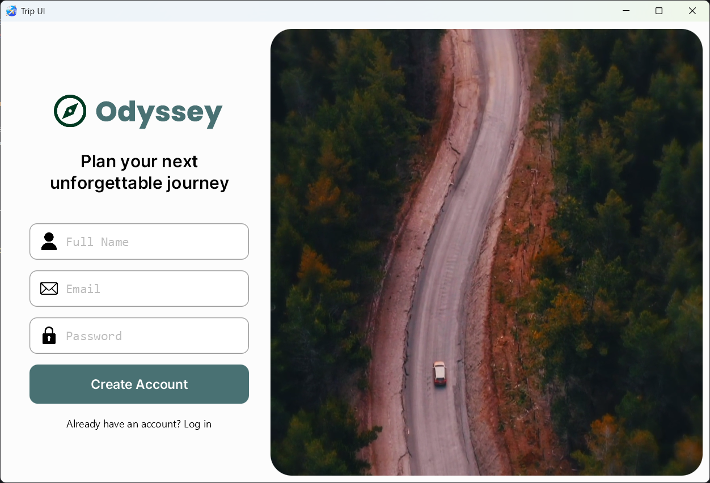
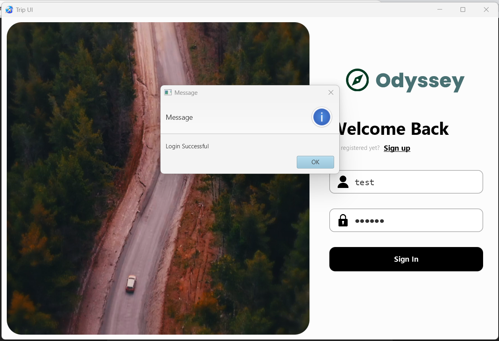

# 🌍 Odyssey – JavaFX Login & Signup UI

**Odyssey** is a sleek, modern JavaFX application featuring animated transitions, a looping video background, and a fully functional login/signup interface backed by a Spring Boot REST API.

> 🎥 **Watch the build:** (https://youtu.be/zVGB9NIBbto?si=9f4dWZwJ0zpgP4E7)  
> 🔁 This version is optimized for learning and showcases JavaFX async UI + REST integration.

---

<p float="left">
  
  
  
</p>

---

## ✨ Features

- 🔐 **User Registration & Login** — Secure input with Spring Boot + BCrypt
- ⚡ **Async API Calls** — Smooth, non-blocking login/signup using `CompletableFuture`
- 🎞️ **Looping Video Background** — Powered by JavaFX `MediaPlayer`
- 🧭 **Animated UI Transitions** — Seamless pane switching with FX animations
- 🎨 **Modern CSS Styling** — Clean, responsive UI with hover/error states

---

## 🛠️ Tech Stack

- **Java 23**
- **JavaFX 23.0.1**
- **Spring Boot (REST API)**
- **Jackson** – JSON serialization/deserialization
- **Lombok** – Clean code with less boilerplate
- **BCrypt** – Password hashing
- **HttpClient** – Java’s async HTTP library
- **Maven** – with wrapper (`./mvnw`)

---

## 🚀 Getting Started

```bash
git clone https://github.com/yourchannel/odyssey-javafx.git
cd odyssey-javafx
./mvnw clean javafx:run
```

---

## 📂 Folder Structure

```bash
src/
├── main/
│   ├── java/
│   │   └── com.example.odyssey/
│   │       ├── App.java
│   │       ├── controller/           # JavaFX controllers (LoginController, etc.)
│   │       ├── model/                # POJOs like User, LoginRequest
│   │       ├── service/              # Handles API calls, logic
│   ├── resources/
│   │   ├── com.example.odyssey/      # FXML layout files
│   │   └── static/                   # Images, video background, CSS
```


### ✅ Final Thoughts

This project proves that **JavaFX apps don’t have to look outdated.**  
With modern design, animations, and clean backend integration — you can build real-world applications that *feel* premium.
