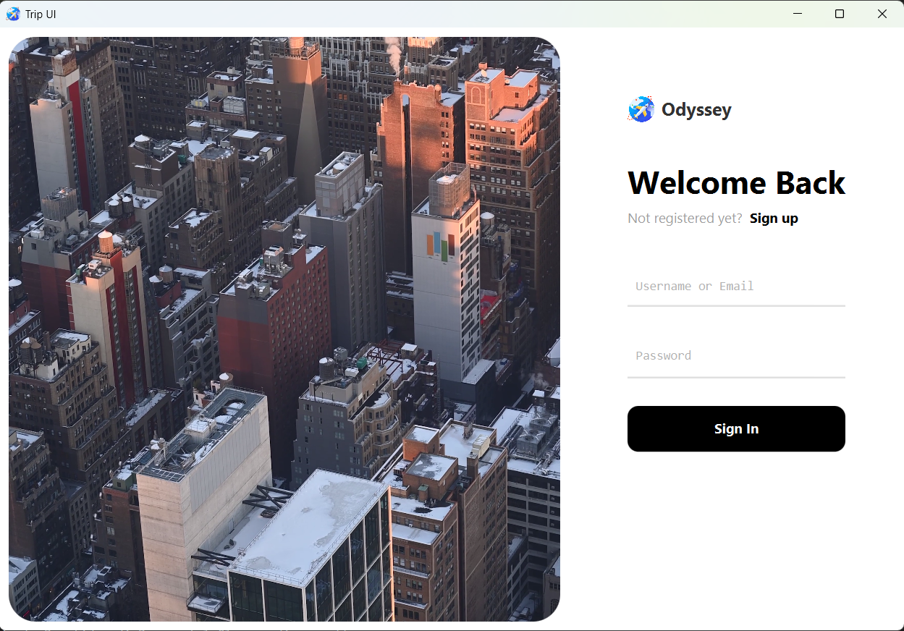

# Odyssey

**Odyssey** is a personal project that simulates a signup and login application for a travel agency. It allows users to securely register, log in, and manage their travel profiles.

## Features
- **User Signup**: New users can create an account by providing basic details.
- **User Login**: Existing users can securely log in with their credentials.
- **JavaFX User Interface**: The application features a clean, user-friendly interface powered by JavaFX.

## Technologies Used
- **Java 23**: The core language for the application.
- **JavaFX**: Used for building the graphical user interface.
- **Maven**: Used for project dependency management and build automation.
- **Bcrypt**: For securely hashing passwords.

## Demonstration

